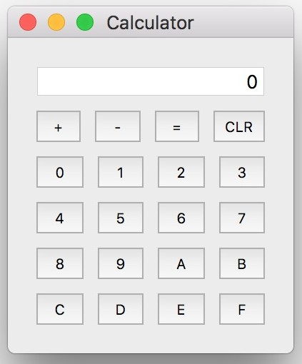

# Qt Hexadecimal Calculator

Hexadecimal Calculator for addition and subtraction operations.



## Installation

```
$ qmake -project "QT+=widgets"
$ qmake qt-hex-calc.pro
$ make
```

## Contribution

Feel free to contribute.

## Distribution

You can distribute this software freely under GNU GPL v3.0.
